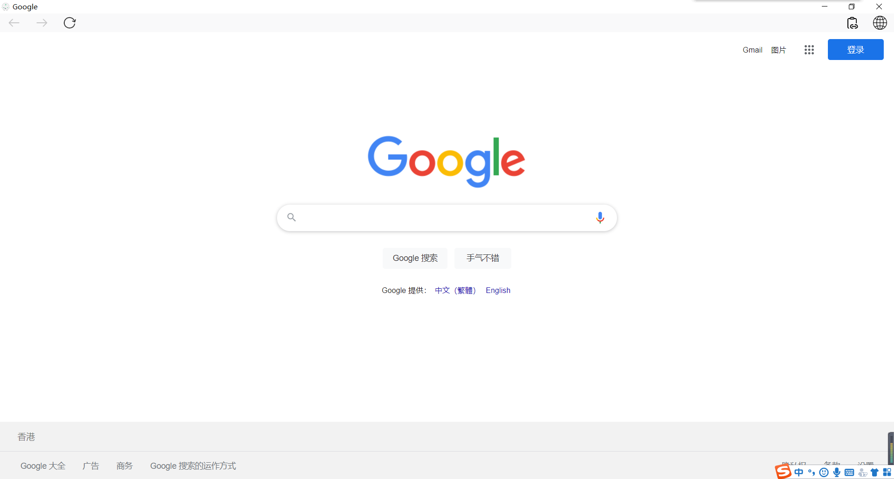

# electron-simple-browser
A simple browser powered by Electron & Vue.

## Project setup
```
yarn
```
## Compiles and hot-reloads for development
```
yarn dev
```
## Compiles and minifies for production
```
yarn build (macOS)

yarn build-win (Windows)
```
## ScreenShot
<p align="center">
  
</p>